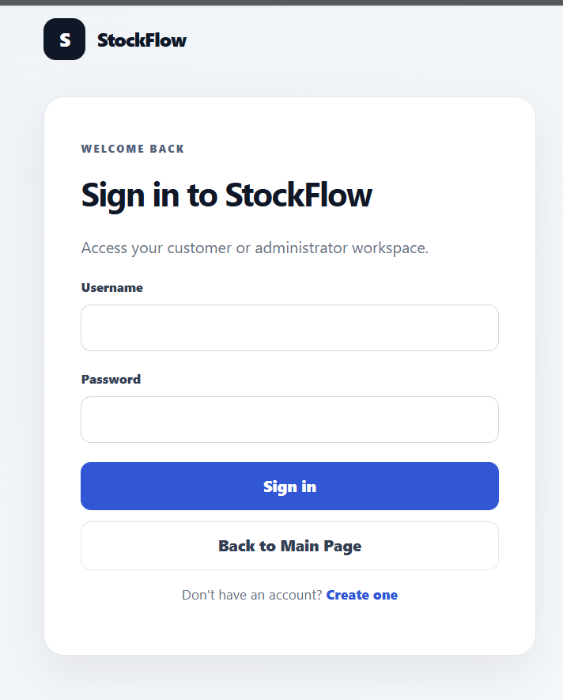
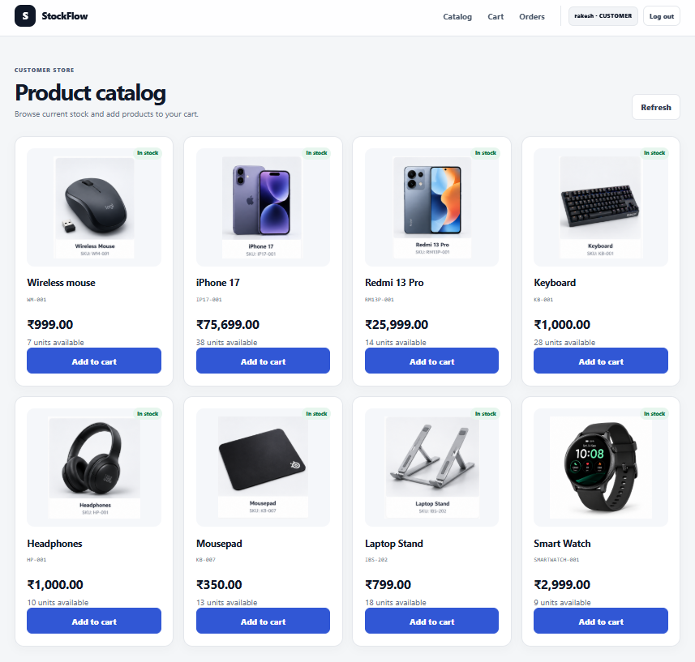
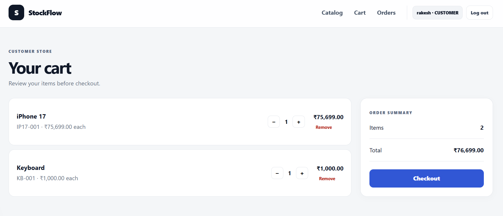
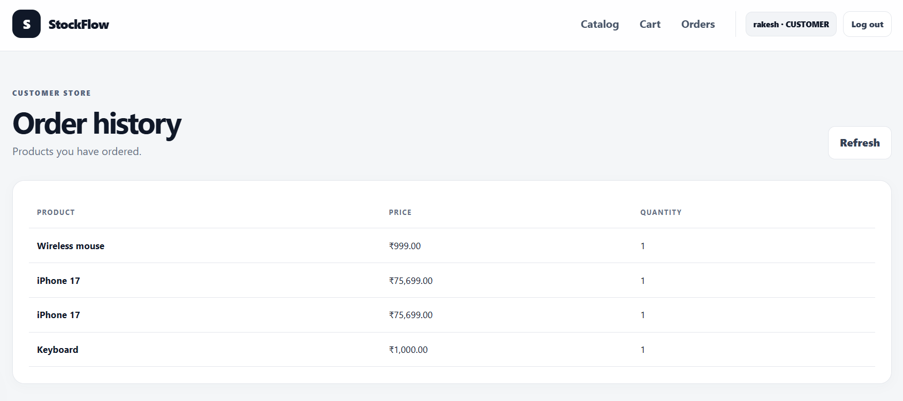
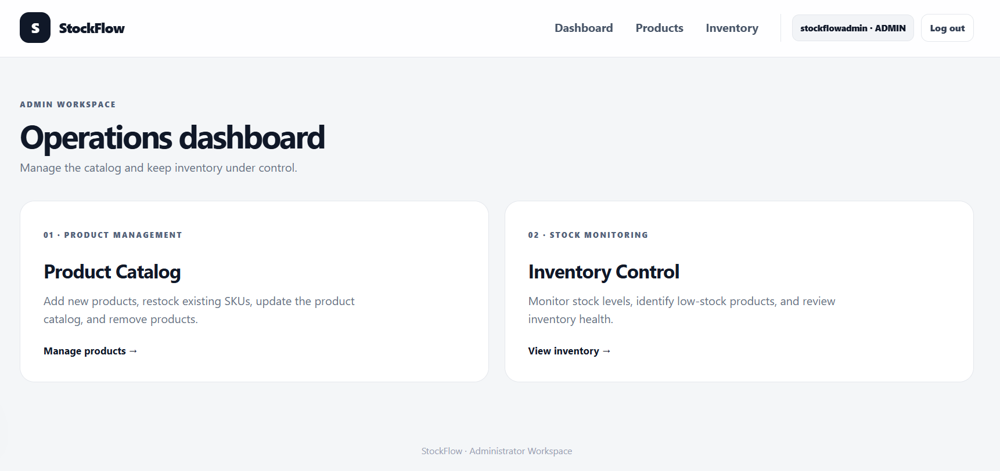
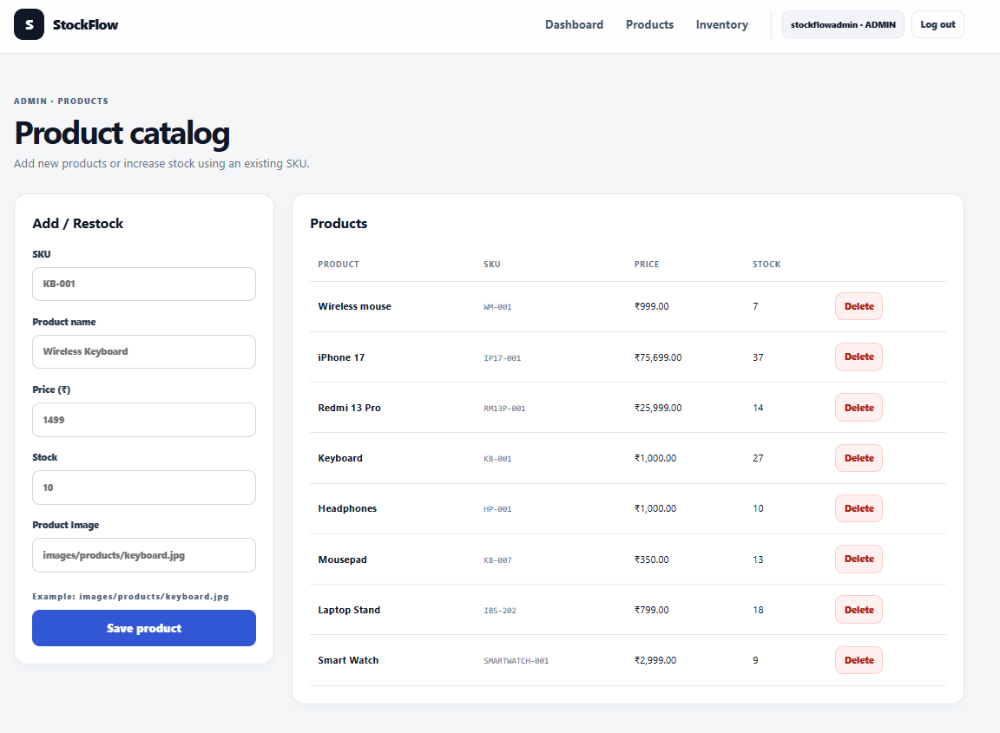
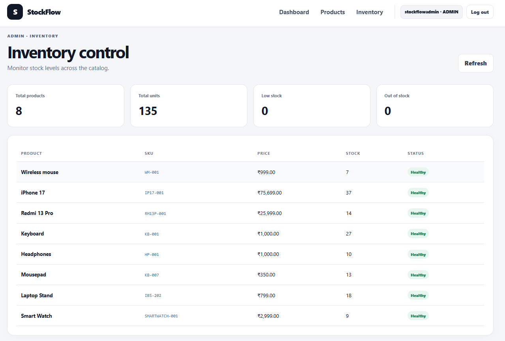

# StockFlow-E-Commerce-Inventory-Management System

A full-stack e-commerce and inventory management application built using **Java and Spring Boot**.

[](https://www.oracle.com/java/) 
[](https://spring.io/projects/spring-boot)  
[](https://www.mysql.com/)  
[](https://spring.io/)  
[](https://railway.app/)  

The application provides product and inventory management, user authentication, role-based authorization, shopping cart functionality, checkout, and order management through RESTful APIs and a responsive web interface.

---

##  Features

###  Authentication & Authorization

- User registration and login
- BCrypt password hashing
- JWT-based authentication
- Role-based authorization
- ADMIN and CUSTOMER roles
- Protected REST API endpoints

###  Product & Inventory Management

- Add products
- View available products
- Delete products
- SKU-based product identification
- Duplicate SKU handling
- Automatically increase stock when an existing SKU is added
- Product price validation
- Stock validation
- Prevent negative inventory

###  Shopping Cart

- Add products to cart
- View cart items
- Update cart quantities
- Remove cart items
- Calculate item subtotals
- Calculate cart total
- Cart checkout

###  Order Management

- Place single-product orders
- Place multi-product orders
- Checkout cart
- Automatic stock deduction
- Insufficient-stock validation
- View customer's order history

###  Validation & Error Handling

- Jakarta Bean Validation
- Centralized exception handling
- Appropriate HTTP status codes
- Product-not-found handling
- Invalid quantity validation
- Insufficient-stock handling
- Duplicate username validation

---

##  Tech Stack

### Backend

- Java
- Spring Boot
- Spring MVC
- Spring Data JPA
- Hibernate
- Spring Security
- JWT
- Maven

### Database

- MySQL

### Frontend

- HTML
- CSS
- JavaScript

### Development Tools

- Visual Studio Code
- Postman
- MySQL Workbench
- Git
- GitHub

---

##  Project Architecture

The application follows a layered backend architecture:

```text
┌──────────────────────┐
│      Controller      │
│  HTTP / REST APIs    │
└──────────┬───────────┘
           │
           ▼
┌──────────────────────┐
│       Service        │
│   Business Logic     │
└──────────┬───────────┘
           │
           ▼
┌──────────────────────┐
│      Repository      │
│   Database Access    │
└──────────┬───────────┘
           │
           ▼
┌──────────────────────┐
│       MySQL          │
│      Database        │
└──────────────────────┘
```

### Main Layers

| Layer | Responsibility |
|---|---|
| **Controller** | Handles HTTP requests and REST API endpoints |
| **Service** | Contains application and business logic |
| **Repository** | Handles database operations using Spring Data JPA |
| **Model** | Contains JPA entities representing database tables |
| **DTO** | Separates API request/response data from database entities |
| **Security** | Handles JWT authentication and role-based authorization |
| **Exception** | Provides centralized application error handling |

---
## 📸 Application Screenshots

### Customer Experience

| Login | Product Catalog |
|---|---|
|  |  |

| Shopping Cart | Order History |
|---|---|
|  |  |

### Admin Experience

| Admin Dashboard | Product Catalog Management |
|---|---|
|  |  |

| Inventory Control |
|---|
|  |


##  Project Structure

```text
Ecommerce/
│
├── .gitignore
├── .gitattributes
├── pom.xml
├── mvnw
├── mvnw.cmd
│
├── .mvn/
│   └── wrapper/
│
└── src/
    └── main/
        │
        ├── java/
        │   └── com/example/ecommerce/
        │       │
        │       ├── config/
        │       │   └── SecurityConfig.java
        │       │
        │       ├── controller/
        │       │   ├── AuthController.java
        │       │   ├── CartController.java
        │       │   └── EcommerceController.java
        │       │
        │       ├── dto/
        │       │   ├── ProductRequestDTO.java
        │       │   ├── ProductResponseDTO.java
        │       │   ├── LoginRequestDTO.java
        │       │   ├── LoginResponseDTO.java
        │       │   ├── UserResponseDTO.java
        │       │   ├── OrderRequestDTO.java
        │       │   ├── OrderResponseDTO.java
        │       │   ├── MultiProductOrderDTO.java
        │       │   ├── OrderItemRequestDTO.java
        │       │   ├── OrderSummaryDTO.java
        │       │   ├── CartItemResponseDTO.java
        │       │   └── CheckoutResponseDTO.java
        │       │
        │       ├── exception/
        │       │   ├── GlobalExceptionHandler.java
        │       │   └── ResourceNotFoundException.java
        │       │
        │       ├── model/
        │       │   ├── Product.java
        │       │   ├── Users.java
        │       │   ├── Orders.java
        │       │   ├── OrderItems.java
        │       │   ├── Cart.java
        │       │   └── CartItem.java
        │       │
        │       ├── repository/
        │       │   ├── ProductRepository.java
        │       │   ├── UserRepository.java
        │       │   ├── OrderRepository.java
        │       │   ├── OrderItemRepository.java
        │       │   ├── CartRepository.java
        │       │   └── CartItemRepository.java
        │       │
        │       ├── security/
        │       │   ├── JwtService.java
        │       │   └── JwtAuthenticationFilter.java
        │       │
        │       └── service/
        │           ├── ProductService.java
        │           ├── UserService.java
        │           ├── OrderService.java
        │           └── CartService.java
        │
        └── resources/
            ├── application.properties
            │
            └── static/
                └── index.html
```

---

##  Security Architecture

The application uses **Spring Security and JWT** for authentication and authorization.

### Authentication Flow

```text
User
  │
  ▼
Login
  │
  ▼
Credentials Validation
  │
  ▼
JWT Token Generated
  │
  ▼
Client Stores Token
  │
  ▼
Authorization: Bearer <token>
  │
  ▼
JWT Authentication Filter
  │
  ▼
Token Validation
  │
  ▼
User Role Loaded
  │
  ▼
Spring Security Authorization
```

### Role-Based Access

| Operation | ADMIN | CUSTOMER |
|---|:---:|:---:|
| Register / Login | ✅ | ✅ |
| View Products | ✅ | ✅ |
| Add Product | ✅ | ❌ |
| Delete Product | ✅ | ❌ |
| Cart Operations | ❌ | ✅ |
| Place Orders | ❌ | ✅ |
| View Own Orders | ❌ | ✅ |

---

##  REST API Endpoints

### Authentication

| Method | Endpoint | Description |
|---|---|---|
| `POST` | `/api/auth/register` | Register a new customer |
| `POST` | `/api/auth/login` | Authenticate user and generate JWT |

### Products

| Method | Endpoint | Description |
|---|---|---|
| `POST` | `/api/product` | Add a product |
| `GET` | `/api/products` | Retrieve products |
| `DELETE` | `/api/product/{id}` | Delete a product |

### Orders

| Method | Endpoint | Description |
|---|---|---|
| `POST` | `/api/order` | Place a single-product order |
| `GET` | `/api/orders/my` | Retrieve logged-in customer's orders |

### Cart

| Method | Endpoint | Description |
|---|---|---|
| `GET` | `/api/cart` | View cart |
| `POST` | `/api/cart/add` | Add product to cart |
| `PUT` | `/api/cart/update/{cartItemId}` | Update cart quantity |
| `DELETE` | `/api/cart/remove/{cartItemId}` | Remove cart item |
| `POST` | `/api/cart/checkout` | Checkout cart |

---

##  Database Design

The application uses **MySQL** with JPA/Hibernate for ORM.

### Main Entities

```text
Users
 │
 ├── Orders
 │     │
 │     └── OrderItems
 │             │
 │             └── Products
 │
 └── Cart
       │
       └── CartItems
               │
               └── Products
```

### Main Database Tables

- `users`
- `product`
- `orders`
- `order_items`
- `cart`
- `cart_item`

Hibernate automatically manages the database schema based on the JPA entity definitions.

---

##  SKU-Based Inventory Management

The application uses **SKU (Stock Keeping Unit)** as the unique identifier for products.

When an administrator attempts to add a product with an existing SKU:

```text
          Add Product
               │
               ▼
          Check SKU
               │
        ┌──────┴──────┐
        │             │
     Exists        Not Found
        │             │
        ▼             ▼
 Increase Stock    Create Product
```

This prevents duplicate product records for the same SKU and keeps inventory consolidated.

---

##  Cart & Checkout Flow

```text
Browse Products
      │
      ▼
Add Product to Cart
      │
      ▼
View Cart
      │
      ▼
Update / Remove Items
      │
      ▼
Checkout
      │
      ▼
Validate Stock
      │
      ▼
Calculate Total
      │
      ▼
Create Order
      │
      ▼
Deduct Inventory
      │
      ▼
Checkout Successful
```

Order and inventory operations are handled transactionally to help maintain data consistency during checkout.

---

##  Configuration

Sensitive configuration values are kept outside the source code using environment variables.

### Required Environment Variables

```text
DB_USERNAME
DB_PASSWORD
JWT_SECRET
```

The `application.properties` file references these variables:

```properties
spring.datasource.username=${DB_USERNAME}
spring.datasource.password=${DB_PASSWORD}

jwt.secret=${JWT_SECRET}
jwt.expiration=3600000
```

### Windows PowerShell

Set the variables before starting the application:

```powershell
$env:DB_USERNAME="root"
$env:DB_PASSWORD="YOUR_MYSQL_PASSWORD"
$env:JWT_SECRET="YOUR_LONG_RANDOM_SECRET"
```

> Never commit actual database passwords or JWT secrets to GitHub.

---

##  How to Run

### Prerequisites

Install the following:

- Java 25
- MySQL
- Git
- Maven *(optional — Maven Wrapper is included)*

### 1. Clone the Repository

```bash
git clone https://github.com/Kushalc05/Ecommerce-Inventory-Management.git
```

```bash
cd Ecommerce-Inventory-Management
```

### 2. Create the Database

Open MySQL and execute:

```sql
CREATE DATABASE ecommerce;
```

### 3. Configure Environment Variables

Windows PowerShell:

```powershell
$env:DB_USERNAME="root"
$env:DB_PASSWORD="YOUR_MYSQL_PASSWORD"
$env:JWT_SECRET="YOUR_LONG_RANDOM_SECRET"
```

### 4. Start the Application

Using Maven Wrapper:

```powershell
.\mvnw spring-boot:run
```

The application will start on:

```text
http://localhost:8080
```

The frontend is served from the Spring Boot application.

---

##  Testing

The application has been tested using **Postman** and the web frontend.

### Authentication

- User registration
- User login
- Duplicate username validation
- Invalid credentials
- JWT authentication
- Invalid JWT handling
- Role-based authorization

### Product & Inventory

- Product creation
- Product retrieval
- Product deletion
- SKU-based inventory handling
- Duplicate SKU handling
- Price validation
- Stock validation

### Cart

- Add product to cart
- View cart
- Update quantity
- Remove cart item
- Cart total calculation
- Checkout

### Orders

- Single-product orders
- Multi-product orders
- Customer order history
- Automatic inventory deduction
- Insufficient-stock validation

### Error Handling

- Request validation
- Centralized exception handling
- Resource-not-found handling
- Authentication checks
- Authorization checks

---

##  Key Implementation Highlights

### Layered Architecture

Business logic is separated from controllers and database access using:

```text
Controller
    ↓
Service
    ↓
Repository
```

This improves code organization and makes the application easier to maintain and extend.

### DTO-Based API Design

Request and response DTOs are used to separate API data from JPA entities and provide controlled validation.

### JWT Authentication

JWT tokens are generated after successful login and validated for protected API requests.

### Role-Based Authorization

Spring Security restricts administrative operations such as product creation and deletion to users with the `ADMIN` role.

### Transactional Order Processing

Order placement and inventory updates are processed within transactions to maintain consistency.

### Centralized Exception Handling

`GlobalExceptionHandler` provides consistent API responses for validation errors, invalid requests, and missing resources.

---

##  Future Improvements

Potential future enhancements include:

- Product search and filtering
- Pagination
- Product categories
- Order status management
- Admin dashboard analytics
- Product image upload
- Payment gateway integration
- Expanded unit and integration testing
- Cloud deployment

---

##  Author

### Kushal C

**Java Full Stack Developer**

```text
Java • Spring Boot • Spring Security • REST APIs
Spring Data JPA • Hibernate • MySQL
HTML • CSS • JavaScript
```

---

##  Project Status

**Functional and actively maintained.**

The current implementation includes:

- ✅ User authentication
- ✅ JWT security
- ✅ Role-based authorization
- ✅ Product management
- ✅ SKU-based inventory management
- ✅ Shopping cart
- ✅ Checkout
- ✅ Order processing
- ✅ Order history
- ✅ Validation
- ✅ Centralized exception handling
- ✅ Responsive web frontend
